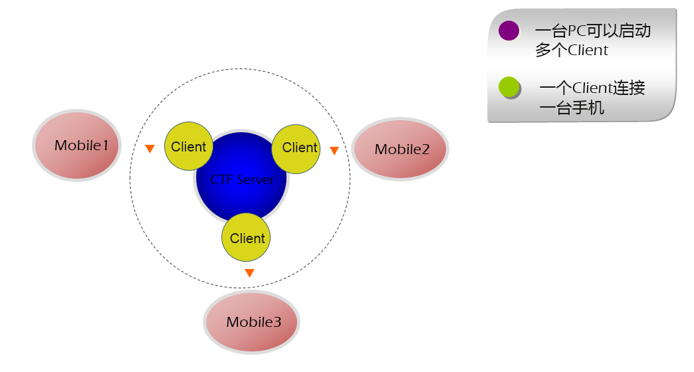
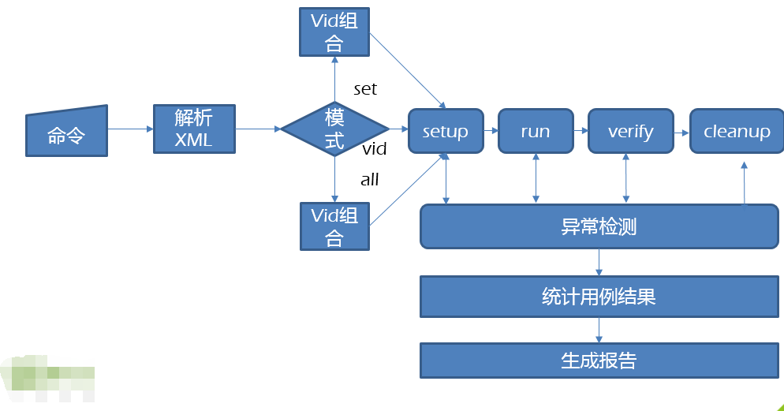

# CTF #

**CTF项目正在开发中**
ctf是测试工具和测试框架的集合，主要用于android设备进行UI自动化脚本编写。其最底层基于Google uiautomator，Google提供的[uiautomator](https://developer.android.com/training/testing/ui-automator.html)库可以获取屏幕上任意一个APP的任意一个控件属性，并对其进行任意操作。但是只能使用Java进行编写，每次测试都需连接数据线，上传至设备才能运行。非常感谢[xiaocong/uiautomator](https://github.com/xiaocong/uiautomator)将Google uiautomator封装并能使用Python编写、
也感谢[codeskybule/openatx/uiautomator2](https://github.com/openatx/uiautomator2)对[xiaocong/uiautomator](https://github.com/xiaocong/uiautomator)的增强,让脚本编写抛开数据线，让云测方案实现了可能性。本项目目的是利用[openatx](https://github.com/openatx)和[gautomtor](https://github.com/Tencent/GAutomator)实现对Unity设备进行云测管理、以及编写自动化脚本。

**CTF自动化测试框架**
  - **[CTF介绍](#CTF介绍)**
  - **[CTF组织结构](#CTF组织结构)**
  - **[CTF技术栈](#CTF技术栈)**
     - **[CTF-Openatx](#CTF-Openatx)**
     - **[CTF-GAutomator](#CTF-GAutomator)**
     - **[CTF-Jinja2](#CTF-Jinja2)**
     - **[CTF-yaml](#CTF-yaml)**
  - **[CTF应用场景](#CTF应用场景)**
     - **[CTF与Unity](#CTF与Unity)**
     - **[CTF语音自动化](#CTF语音自动化)**
     - **[CTF云测方案](#CTF云测方案)**
  - **[CTFServer](#CTFServer)**
     - **[CTFServer运行流程](#CTFServer运行流程)**
  - **[CTFHTML](#CTFHTML)**
     - **[1.1 CTFHTML标签](#1.1-CTFHTML标签)**
     - **[1.2 CTFHTML用例](#1.2-CTFHTML用例)**
        - **[1.2.1 一个简单的HTML用例](#1.2.1-一个简单的HTML用例)**
        - **[1.2.2 CTFHTML与jinja2](#1.2.2-CTFHTML与jinja2)**
        - **[1.2.3 HTML中获取结构化数据](#1.2.3-HTML中获取结构化数据)**
        - **[1.2.4 HTML中使用自身模块接口](#1.2.4-HTML中使用自身模块接口)**
        - **[1.2.5 HTML中使用Unittest断言](#1.2.5-HTML中使用Unittest断言)**
        - **[1.2.6 HTML中使用Uiautomator2接口](#1.2.7-HTML中使用Uiautomator2接口)**
     - **[1.3 CTFHTML用例驱动方式](#1.3-CTFHTML用例驱动方式)**
        - **[1.3.1 运行一个用例](#1.3.1-运行一个用例)**
        - **[1.3.2 运行一组用例](#1.3.2-运行一组用例)**
        - **[1.3.3 运行相同优先级用例](#1.3.3-运行相同优先级用例)**
        - **[1.3.4 运行所有用例](#1.3.4-运行所有用例)**
        - **[1.3.5 运行指定目录的所有HTML](#1.3.5-运行指定目录的所有HTML)**
  - **[CTFTestCase](#CTFTestCase)**
     - **[CTFTestCase基本概念](#CTFTestCase基本概念)**
     - **[一个简单的CTFTestCase示例](#一个简单的CTFTestCase示例)**
     - **[CTFSelector](#CTFSelector)**
         - **[CTF android ui元素提取](#CTF-android-ui元素提取)**
         - **[CTFSelector使用方式](#CTFSelector使用方式)**
         - **[Selector使用方式](#Selector使用方式)**
  - **[CTFTestCase与CTFHTML的关系](#CTFTestCase与CTFHTML的关系)**
    - **[CTFTestCase管理方式](#CTFTestCase管理方式)**
    - **[CTFTestCase与CTFHTML联合编写](#CTFTestCase与CTFHTML联合编写)**
  - **[一个完整的示例](#一个完整的示例)**

### CTF介绍
CTF是英文cloud test framework的简称，是一款C/S架构的自动化测试的测试框架。设计思路有借鉴于一款名为MCF的测试工具，在自动化脚本管理方面，提供yaml结构化的参数管理、基于jinja2形式的用例编写、基于标签化的用例管理、多种用例驱动方式等。

### CTF组织结构


-------

### CTF技术栈
#### CTF-Openatx
 1. CTF使用[atx-agent](https://github.com/openatx/atx-agent)来通过wifi控制手机，并在基础上增加Socket代理，实现[GAutomator](https://github.com/Tencent/GAutomator)的无线通信.
 2. CTF使用[android-uiautomator-server](https://github.com/openatx/android-uiautomator-server)来实现[UIAutomator](http://developer.android.com/tools/testing/testing_ui.html)的封装，以及设备界面上的设置
 3. CTF使用[uiautomator2](https://github.com/openatx/uiautomator2)来做端的控制
 
#### CTF-GAutomator
 1. CTF使用[GAutomator](https://github.com/Tencent/GAutomator)来控制Unity设备
 2. CTF抛弃[GAutomator](https://github.com/Tencent/GAutomator)中有线连接的方式，将其通信纳入openatx通信，实现无线连接
 
#### CTF-Jinja2
 CTF使用[Jinja2](http://docs.jinkan.org/docs/jinja2/templates.html)语法来渲染HTML用例文件，使CTFHTML用例极具灵活性，提高CTF用例复用性、降低CTF用例管理的成本
 
#### CTF-yaml
 CTF使用yaml来保存用例编写过程中的参数，提供对应取参接口，可以在CTFTestCase和CTFHTML中使用。UI定位元素可形成UI树，结构化管理参数。
 
 
 -------

### CTF应用场景
#### CTF与Unity
 CTF基于[GAutomator](https://github.com/Tencent/GAutomator)封装了GameEngine，能基本满足Unity功能自动化。

#### CTF语音自动化
 CTF在[android-uiautomator-server](https://github.com/openatx/android-uiautomator-server)中增加了Anddroid SoundPool接口，并在CTFClient端使用[uiautomator2](https://github.com/openatx/uiautomator2)对其封装供测试人员调用。 目前只具备较为简单的流程。
 1. 根据用例要求事先录制完音频文件，放置在CTFClient工程特定目录common/sounds中
 2. 调用CTFClient中CTFRemoteDevice中app_play_sound接口
 3. 在装有CTFApp的设备端将播放指定的音频文件
 4. 脚本端验证音频播放后的结果

#### CTF云测方案
 CTF云测体系分CTFApp（由二次开发的[atx-agent](https://github.com/openatx/atx-agent)、[android-uiautomator-server](https://github.com/openatx/android-uiautomator-server)组成）、CTFServer、CTFClient（由[uiautomator2](https://github.com/openatx/uiautomator2)、[GAutomator](https://github.com/Tencent/GAutomator)、CTF驱动脚本）构成。
 
 1. CTFApp主要负责具体自动化操作的处理，以及设备端状态的收集反馈给CTFServer
 2. CTFServer主要负责控制自动化流程、收集并管理在线的CTFApp端的设备
 3. CTFClient提供基于[GAutomator](https://github.com/Tencent/GAutomator)封装的Unity引擎接口、提高基于[uiautomator2](https://github.com/openatx/uiautomator2)封装的远程设备接口，并负责渲染HTML，驱动CTFHTML运行并生成report
 
 -------

### CTFServer
#### CTFServer运行流程
 

### CTFHTML
## 1.1 CTFHTML标签

CTF标签 | 概述 | 说明 |是否支持 
:-------------: | :-------------:|:-------------: | :-------------: 
**[val](#val)**| recm标签的值标签 | 代表recm单次的取值 | 是
**[recm](#recm)**| 多值记录标签，可以包含多个值，用例运行期间将选择其中一个值。选择方式将取决于var标签的permutation属性，permutation属性取值为rows、pict、full其中一个。目前只支持rows依次取值 | 当var的permutation属性值为rows时，表示用例运行3次，依次取package1、package2、package3才测试 | 是
**[var](#var)**| 测试用例数据抽象集合。表示一个测试单元，包含了用例脚本运行逻辑和运行时所需要的数据。|  set为用例分组必须为整数，lvl为用例分优先级必须为整数，vid为用例编号必须为整数且全局唯一，dsc为用例描述，permutation属性可选目前只支持rows属性值 | 是
**[cluster](#cluster)**| 多个opt标签构成的一个标签集合。表示一个操作集执行时所有的逻辑步骤 |   dsc操作集描述，module载入模块，exec为cluster执行的规则有三种取值INTURN、RANDOM、CUSTOM。CUSTOM可以和INTURN、RANDOM进行取或。INTURN表示顺序执行opt标签、RANDOM表示随机执行opt标签、CUSTOM表示在执行cluster标签之前从module中载入一个函数运行。repetition的属性值必须为整数，表示cluster标签执行的次数。flow的属性值为setup、run、verify、cleanup中的一个，cluster操作集是属于用例流程中的哪一个，需注意用例是按照setup->run->verify->cleanup的顺序执行 | 是
**[opt](#opt)**| cluster标签的下的子标签。表示一个功能点执行时的细分步骤，所需要的操作以及操作时所需要的数据 |表示引用snippet的id为playVideo的标签下的操作| 是
**[arg](#arg)**| opt标签fnc的参数 | 表示opt标签的参数，opt标签下可以存在多个arg标签，即参数可以是多个 |是
**[grp](#grp)**| 系统环境标签。一张HTML数据配置文件只能存在一个grp标签，表示系统环境初始化 |  grp标签的permutation的含义和var标签一样 | 是
**[varmap](#varmap)**| 数据配置文件标签。一个系统的测试逻辑的抽象 | CTFHTML根节点 |是


-------
## 1.2 CTFHTML用例
#### 1.2.1 一个简单的HTML用例
CTF用例使用CTFHTML标签编写，根级为varmap标签、var为用例标签、grp为系统初始化标签。示例如下：
```html
<varmap id="ctf-testcases" xmlns="https://github.com/leoche666" >
    
   <var set="1" lvl="2" vid="1" id="启动时间-1" permutation="rows">
     <cluster id="验证并点击跳过按钮" module="workspace.start_time" exec="CUSTOM(TestCase1)" flow="setup"/>
   </var>
   
   <grp permutation="rows" >
     <cluster id="清理环境" module="common.templates" exec="INTURN" flow="cleanup">
       <opt id="关闭app" fnc="device.app_clear">
         <arg>com.android.xxx</arg>
       </opt>
     </cluster> 
   </grp>
</varmap>
```

-------

#### 1.2.2 CTFHTML与jinja2
为了使HTML编写极具灵活性，CTFHTML支持Jinja2语法。CTF提供多个模板来帮助你编写CTFHTML用例。

 1. 基类模板ctf_template.html。定义CTFHTML组织架构，并提供相关jinja宏帮助用例编写
```html
<varmap id="ctf-testcases" xmlns="https://github.com/leoche666" >
    
        <opt fnc="{{ fnc }}">
            
                <arg>{{ varargs[i] }}</arg>
            
        </opt>
    

    
        
            <cluster id="{{ id }}" module="{{ module }}" exec="{{ exec }}" flow="{{ flow }}" />
        
    

    
        
            <cluster id="{{ id }}" module="{{ module }}" exec="{{ exec }}" flow="{{ flow }}">
                {{ caller() }}
            </cluster>
        
    

    
        
            <cluster id="向server注册异常重跑" module="ctf_client" exec="CUSTOM(RerunWhenException)" flow="setup"/>
        
            <cluster id="向server注册异常重跑" module="ctf_client" exec="CUSTOM(RerunWhenVarAbort)" flow="setup"/>
        
        <rec key="count">{{ count }}</rec>
    

    
        <cluster id="初始化APP环境" module="common.templates" exec="CUSTOM(InitApp)" flow="setup"/>
    

    
        <cluster id="清理环境" module="common.templates" exec="INTURN" flow="cleanup">
            <opt id="关闭app" fnc="device.app_clear">
                <arg>{{'conf'|get_params("ENV.TESTAPP.package") }}</arg>
            </opt>
        </cluster>
    

    
    

    <grp permutation="rows" >
        
    </grp>
</varmap>
```

 2. 辅助模板app_template.html。提取自动化过程中复用的操作，定义成jinja宏
```html
<?xml version="1.0" encoding="UTF-8"?>
<!DOCTYPE html
        PUBLIC "-//W3C//DTD XHTML 1.0 Transitional//EN"
        "http://www.w3.org/TR/xhtml1/DTD/xhtml1-transitional.dtd">
<html xmlns="http://www.w3.org/1999/xhtml" xml:lang="en" lang="en">

    
        <cluster id="杀死app进入2D登录界面" module="common.templates" exec="CUSTOM(EnterHomePage)" flow="setup"/>
    

    
        <cluster id="进入登录界面并输入用户名密码登录，并回到竖版首页" module="common.templates" exec="CUSTOM(LoginAndEnterHomePage)" flow="setup" />
        <rec key="登录成功提示">退出登录</rec>
    

    
        <cluster id="搜索一部影片选取第一项接口点击播放，并起播成功" module="common.templates" exec="CUSTOM(SearchVideo)" flow="setup" />
        <rec key="search">{{ video }}</rec>
    

    
        
            {{ login() }}
        
        
            {{ search(video) }}
        
        <cluster id="验证起播成功" module="common.logic.show" exec="INTURN" flow="setup">
			<opt id="验证起播成功" fnc="verify_play_success">
				<arg>{{ 'app'|ctf_ui("unity_ui_tree.broadcast_cl_common.crt_time") }}</arg>
			</opt>
		</cluster>
    
</html>
```

 3. CTF用例文件。 示例app_test.html。
 
```html


    

    <var set="1" lvl="2" vid="1" id="启动时间-1" permutation="rows">
        <cluster id="验证并点击跳过按钮" module="workspace.start_time" exec="CUSTOM(TestCase1)" flow="setup"/>
    </var>

    <var set="1" lvl="1" vid="2" id="普通视频播放中，播控显示正确" permutation="rows">
        {{ play_one_video(isCommonVideoBySearch=True, video="生化危机：终章（3D）") }}
        <cluster id="展示音量、清晰度、视角锁定按钮、设置按钮、播控下方显示视频名称、退出、视角复位按钮" module="common.logic.show" exec="INTURN" flow="verify">
            <opt id="展示音量" fnc="verify_show_for_player">
                <arg>{{ "app"|ctf_ui("unity_ui_tree.broadcast_cl_common.volume") }}</arg>
                <arg>音量</arg>
            </opt>
            <opt id="展示清晰度" fnc="verify_show_for_player">
                <arg>{{ "app"|ctf_ui("unity_ui_tree.broadcast_cl_common.definition") }}</arg>
                <arg>清晰度</arg>
            </opt>
            <opt id="展示锁定视角btn" fnc="verify_show_for_player">
                <arg>{{ "app"|ctf_ui("unity_ui_tree.broadcast_cl_common.sight_lock") }}</arg>
            </opt>
        </cluster>
    </var>



    {{ init_app() }}
    {{ rerun(exp='VarAbort', count=2) }}
    {{ clear_app() }}


```

-------


#### 1.2.3 HTML中获取结构化数据
 1. 存在如下结构yaml文件app.yaml
 
```yaml 
native_ui_tree:
  # app动画中跳出按钮
  skip_btn:
    resourceId: com.xxx.xxx.cb:id/skip_text
  # 首页
  navigation_bar_bottom:
    # 视频
    video_tab:
      resourceId: com.xxx.xxx.cb:id/id_tab_recommend_img
      className: android.widget.ImageButton
    # 游戏
    game_tab:
      resourceId: com.xxx.xxx.cb:id/id_tab_game_img
      className: android.widget.ImageButton
    # 搜索
    search_tab:
      resourceId: com.xxx.xxx.cb:id/id_tab_search_img
      className: android.widget.ImageButton
    # 我的
    my_tab:
      resourceId: com.xxx.xxx.cb:id/id_tab_me_img
      className: android.widget.ImageButton
    # 分屏按钮
    split_tab:
      resourceId: com.xxx.xxx.cb:id/id_tab_entry
      className: android.widget.LinearLayout
```

 2. 在CTFHTML中获取app.yaml中名为video_tab的ctf-selecotor-ui元素
 
```html
<opt id="展示视频按钮" fnc="verify_show_for_player">
    <arg>{{ "app"|ctf_ui("native_ui_tree.navigation_bar_bottom.video_tab") }}</arg>
    <arg>视频</arg>
</opt>

```

-------

#### 1.2.4 HTML中使用自身模块接口
假设python模块common.logic中含有一个函数add，参数为a和b，实现两数相加。在CTFHTML中可以这么调用。

```html
<cluster id="测试" module="common.logic" exec="INTURN" flow="verify">
    <opt id="两数相加" fnc="test">
        <arg>1</arg>
        <arg>2</arg>
    </opt>
</cluster>
```

也可以使用my_self来调用自身模块的属性
```html
<cluster id="测试" module="common.logic" exec="INTURN" flow="verify">
    <opt id="两数相加" fnc="my_self.test">
        <arg>1</arg>
        <arg>2</arg>
    </opt>
</cluster>
```

-------

#### 1.2.5 HTML中使用Unittest断言
可以直接在CTFHTML中使用unittest关键字来调用unittest中的断言方法
```html
<cluster id="测试" module="common.logic" exec="INTURN" flow="verify">
    <opt id="unittest断言" fnc="unittest.assertTrue">
        <arg>False</arg>
    </opt>
</cluster>
```

-------


#### 1.2.6 HTML中使用Uiautomator2接口
可以直接在CTFHTML中使用device关键字来调用ctf封装的uiaumator2中的方法
```html
<cluster id="测试" module="common.logic" exec="INTURN" flow="verify">
    <opt id="展示一个toast" fnc="device.toast.show">
        <arg>Hello world</arg>
    </opt>
</cluster>
```

-------

## 1.3 CTFHTML用例驱动方式
#### 1.3.1 运行一个用例
``python manage.py  -html {html名字} -vid {用例编号}``

#### 1.3.2 运行一组用例
``python manage.py  -html {html名字} -set {用例组号}``

#### 1.3.3 运行相同优先级用例
``python manage.py  -html {html名字} -lvl {用例优先级}``

#### 1.3.4 运行所有用例
``python manage.py  -html {html名字} -all``

#### 1.3.5 运行指定目录的所有HTML
``python manage.py -dir {用例运行方式}``

-------

### CTFTestCase

#### CTFTestCase基本概念
CTFTestCase是python的一个元类，用来控制python编写的类生成使其满足嵌入CTFHTML中的要求，并在类中加入三大模块(CTFClientMoudle、CTFRemoteDevice、CTFRemoteUnityEngine)供编写脚本时使用

#### 一个简单的CTFTestCase示例
```python
from ctf_client import CTFTestCase,CTFJinja2Object

class EnterHomePage(object):
    __metaclass__ = CTFTestCase

    def __init__(self):
        self.testapp = CTFJinja2Object.conf.ENV.TESTAPP.get_result()

    def setup(self):
        # 进入竖版首页
        self._remote_device.app_clear_launch(self.testapp['package'])
        video_tab = CTFJinja2Object.app.native_ui_tree.navigation_bar_bottom.video_tab.get_result()
        self._remote_device.wait_exists_and_enabled(selector=video_tab)

    def cleanup(self):
        self._remote_device.watchers.remove('权限确认')

if __name__ == "__main__":
   EnterHomePage()
```
EnterHomePage一旦实例化，将自动化调用setup()->cleanup()

-------

#### CTFSelector
为了满足yaml结构化的参数存取方式，将[xiaocong/uiautomator](https://github.com/xiaocong/uiautomator)提供的selector定位方式进行封装。提供一种
使用yaml语法就能表示一个selecotor定位的元素及CTFSelector。

#### CTF android ui元素提取
```xml
<node index="0" text="" resource-id="android:id/list" class="android.widget.ListView" ...>
  <node index="0" text="WIRELESS & NETWORKS" resource-id="" class="android.widget.TextView" .../>
  <node index="1" text="" resource-id="" class="android.widget.LinearLayout" ...>
    <node index="1" text="" resource-id="" class="android.widget.RelativeLayout" ...>
      <node index="0" text="Wi‑Fi" resource-id="android:id/title" class="android.widget.TextView" .../>
    </node>
    <node index="2" text="ON" resource-id="com.android.settings:id/switchWidget" class="android.widget.Switch" .../>
  </node>
  ...
</node>
```


CTF使用yaml语法格式对uiautomator selector定位方式进行二次封装，提取Android UI元素和代码分离。下面uiautomator可以使用对应CTFSelector代替的几种结构。

1. 
```python
# get the child or grandchild
d(className="android.widget.ListView").child(text="Bluetooth")
```

```yaml
# CTFSelector
grandchild:
  className: android.widget.ListView
  extand:
    method: child
    text: Bluetooth
```


2.
```python
d(className="android.widget.ListView", resourceId="android:id/list") \
  .child_by_text("Wi‑Fi", className="android.widget.LinearLayout") \
  .child(className="android.widget.Switch")
```

```yaml
# CTFSelector
wifi_switch:
  className: android.widget.ListView
  resourceId: android:id/list
  extand:
   method: child_by_text
   txt: Wi‑Fi
   className: android.widget.LinearLayout
   extand:
    method: child
    className: android.widget.Switch

```


3.
```python
d(text="Add new").child_by_instance(instance=0)
```

```yaml
add_new:
  text: Add new
  extand:
   method: child_by_instance
   instance: 0
  
```

#### CTFSelector使用方式

```python
from ctf_client import CTFTestCase, CTFJinja2Object

class TestCase(object):
    __metaclass__ = CTFTestCase

    def __init__(self):
        # 获取配置文件数据
        self.testapp = CTFJinja2Object.conf.ENV.TESTAPP.get_result()

    def setup(self):
        # 启动app
        self._remote_device.app_clear_launch(self.testapp['package'])
        # 获取app首页底部视频按钮CTFSelector结构
        video_tab = CTFJinja2Object.app.native_ui_tree.navigation_bar_bottom.video_tab.get_result()
        # 等待其显示出来
        self._remote_device.wait_exists_and_enabled(selector=video_tab)
        # 获取app首页底部搜索按钮CTFSelector结构
        search_tab = CTFJinja2Object.app.native_ui_tree.navigation_bar_bottom.search_tab.get_result()
        # 点击搜索按钮
        self._remote_device.click_selector(search_tab)

    def cleanup(self):
        pass

if __name__ == "__main__":
   TestCase()
```

#### Selector使用方式
CTF将定位字段和定位方法提取出来，但是也不能满足所有需求，所以保留了原有的定位风格。
```python
import time
from ctf_client import CTFTestCase, CTFJinja2Object

class TestCase(object):
    __metaclass__ = CTFTestCase

    def __init__(self):
        # 获取配置文件数据
        self.testapp = CTFJinja2Object.conf.ENV.TESTAPP.get_result()

    def setup(self):
        # 启动app
        self._remote_device.app_clear_launch(self.testapp['package'])
        time.sleep(5)
        # 选取我的选项卡并点击
        self._remote_device(resourceId="com.xxx.xxx.cb:id/id_tab_me")\
            .child(text="我的", className="android.widget.TextView").click()
    
    def cleanup(self):
        pass

if __name__ == "__main__":
   TestCase()
```

-------

## CTFTestCase与CTFHTML的关系

#### CTFTestCase管理方式
CTFTestCase必须嵌入到CTFHTML中才能使用CTFClientMoudle、CTFRemoteDevice、CTFRemoteUnityEngine三大模块接口，否则会出错。CTFTestCase使用CTFHTML   中cluster标签的exec字段来嵌入调用。

```html
<var set="1" lvl="2" vid="1" id="启动时间-1" permutation="rows">
    <cluster id="验证并点击跳过按钮" module="workspace.start_time" exec="CUSTOM(TestCase1)" flow="setup"/>
</var>
```
则是将模块workspace.start_time中的TestCase1类（CTFTestCase类）嵌入到HTML中


#### CTFTestCase与CTFHTML联合编写
```html
<var set="3" lvl="2" vid="1" id="搜索结果页切换3D点击进入分屏并正常播放" permutation="rows">
    <cluster id="搜索播放" module="workspace.leoche.search" exec="CUSTOM(SwitchPageAndPlay)" flow="setup"/>
    <cluster id="验证起播成功" module="workspace.leoche" exec="INTURN" flow="verify">
        <opt id="验证起播成功" fnc="verify_play_success">
            <arg>{{ 'app'|ctf_ui("unity_ui_tree.broadcast_cl_common.crt_time") }}</arg>
        </opt>
    </cluster>
</var>
```


## 一个完整的示例
请查看workspace/test.html,运行使用CTF驱动命令运行
